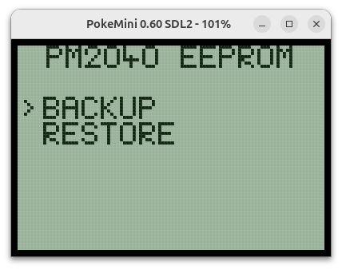
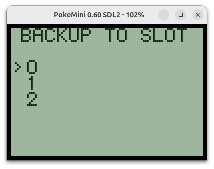
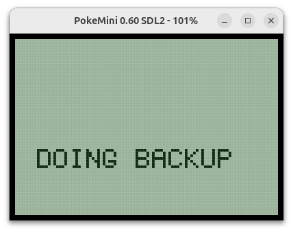
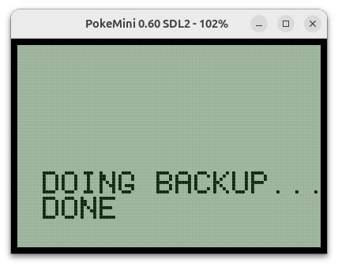
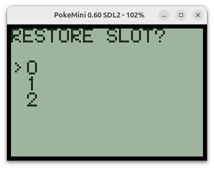
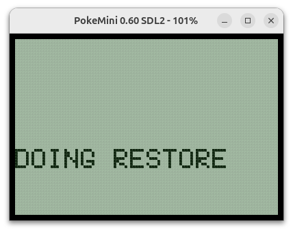
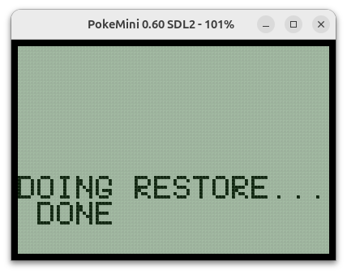
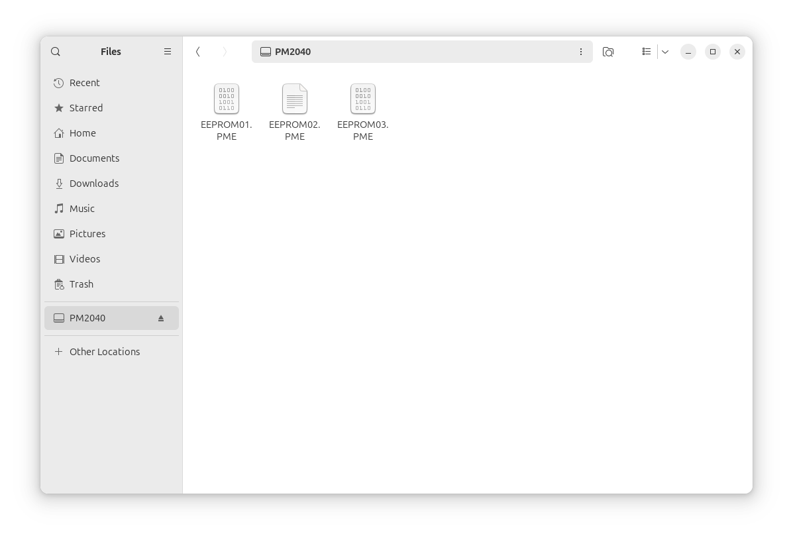

# PM2040 EEPROM Manager
An EEPROM backup and restore program for the PM2040 flash cart.

## Overview
This program is intended only to be used in combination with a [PM2040-based flash cart](https://github.com/zwenergy/PM2040) and a suitable PM2040 FW.
A ready to flash FW for a regular 2MB PM2040 flash cart containing this EEPROM manager is available at the [PM2040 repo](https://github.com/zwenergy/PM2040/tree/eeprom_manage/eeprom_manage_builds).

For PM2040-based carts with 16MB Flash, you can also find a multi ROM menu FW with EEPROM manager support added [here](https://github.com/zwenergy/PM2040/tree/eeprom_manage/eeprom_manage_builds).
In this case, you can just add the pre-compiled ROM file from [here](https://github.com/zwenergy/PM2040-EEPROM-Manager/releases) to any slot of the multi menu.

**Note that the simple "ROM-less base FW" for regular ROMs does NOT work, as the EEPROM manager expects certain PM2040-specific behaviours, which is not baked in to the regular FW.**

## Functionality
The core idea of this PM2040 EEPROM manager is to offer a way to back up or restore the EEPROM of the Pokemon Mini handheld.
Save files are not stored on the carts, but rather on the EEPROM of the handheld.
The Pokemon Mini can store up to 6 save files, but with 10 games overall published + some homebrew may also use the EEPROM, you can run out of save game memory.

The PM2040 EEPROM manager offers 3 EEPROM backup slots which are stored on the PM2040 cart's Flash memory.
You can backup the entire current EEPROM content to one of the 3 slots on the cart, and also restore from one of these slots to the handheld's local EEPROM.

Backing up or restoring the EEPROM takes roughly somewhere between 40 secound and 1 minute.
The display will show "...done" once the operation completed.

## Usage
A short overview of how to use it.

**Always make sure to first back up your EEPROM, transfer it to a computer and make sure that it's fine before proceeding with restoring your EEPROM.**

### 1. Prepare PM2040-based Flash Cart
#### 2MB variant
Due to the lower memory of the 2MB variant, the EEPROM manager should be used as a single ROM FW.
A pre-compiled UF2 firmware with the latest EEPROM manager added can be found [here](https://github.com/zwenergy/PM2040/tree/eeprom_manage/eeprom_manage_builds).
Transfer the UF2 firmware onto the flash cart.

#### 16MB variant
For 16MB variants, the EEPROM manager can be used in combination with a multi ROM menu (which has the support for the EEPROM manager added).
A fitting pre-compiled multi ROM menu can be found [here](https://github.com/zwenergy/PM2040/tree/eeprom_manage/eeprom_manage_builds).
Use a web patcher of your choice to add regular ROMs, as well as the EEPROM manager from [here](https://github.com/zwenergy/PM2040-EEPROM-Manager/releases) to the multi ROM menu.
Finally, transfer the patched UF2 file to the flash cart.

### 2. Do a backup the current EEPROM

**Always do a backup of current content of your EEPROM first.**
Choose "BACKUP".

Choose one of the three available backup slots.
Press "A" to start.

Now the current content of the EEPROM is copied onto the flash cart.

Wait until the display shows "DONE". 
Pressing "A" or "B" will return to the main menu.

### 3. Restore a previously backed up EEPROM image
You can copy a previously backed up EEPROM state from the flash cart back to the console's internal EEPROM.
For this, choose "RESTORE" from the main menu.

Choose which backup slot on the cart should be read and copied to the console's EEPROM.
Press "A" to start.

Now the content of the chosen slot is read from the flash cart and copied into the console's EEPROM.

Wait until the display shows "DONE". 
Pressing "A" or "B" will return to the main menu.

## Further managing the EEPROMs via USB
### 2MB variant
An alternative "EEPROM USB drive" firmware for the PM2040 flash cart is available at the [repo here](https://github.com/zwenergy/PM2040-EEPROM-USB-Drive).
When flashing this firmware to the PM2040, it will function as a USB drive and display the 3 EEPROM slots from the cart.
This way, you can easily backup all save files via USB to a computer.

### 16MB variant
In case of the 16MB variant, "EEPROM USB drive" functionality should be already included in the multi ROM menu.
For this, connect the flash cart via USB to a computer.
**After** connecting via USB, hold the BOOT button (may be also labeled "FLASH" or similar) for at least 5 seconds.
The flash cart will then appear as a flash drive, presenting the 3 EEPROM slots.

EEPROM01.PME corresponds to slot 0, EEPROM02.PME to slot 1 and EEPROM03.PME corresponds to slot 2.
The backed up EEPROM images can be simply copied over from there.

**Note: All slots are always shown, even when nothing have been backed up to them yet.**

#### Writing / Restore
Currently only slot 0 (EEPROM01.PME) can be overwritten via USB. When any EEPROM backup is copied to the cart (...or more exactly any file which is exactly 8192 bytes large), EEPROM slot 0 is overwritten. 
The cart is then automatically ejected, while internally the EEPROM slot is re-flashed. After it, the PM2040 will be connected again.

#### Managing Single Save Games
The EEPROM file is a complete image of the internal EEPROM memory, so it contains up to 6 save games.
To further manage single save games, export, merge and create new EEPROM images for the Pokemon mini, you can use a very handy tool made by *thx*:
[Pokémon Mini EEPROM Manager](https://pokeminisaves.github.io/) .
